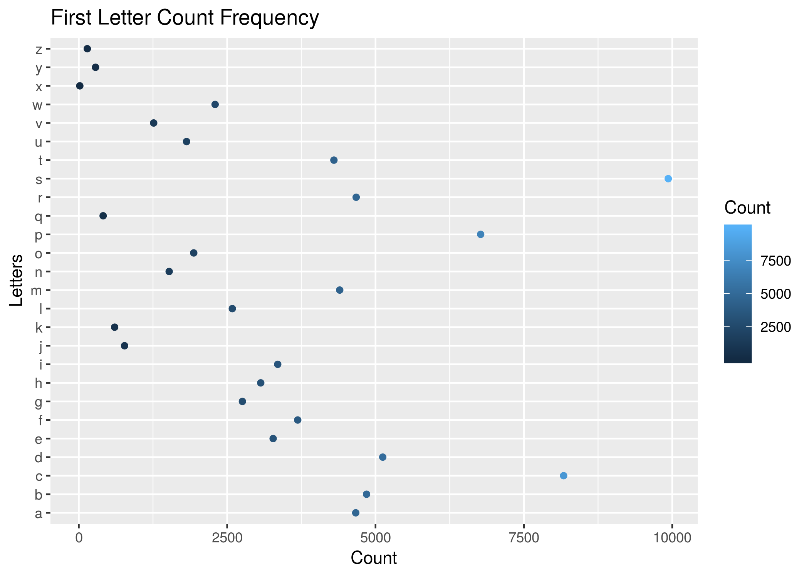

```{r}
options(warn = -1) # supresses warnings
suppressPackageStartupMessages(library(tidyverse))
```

```{r setup, include=FALSE}
knitr::opts_chunk$set(echo = TRUE)
```

```{r}
library(tidyverse)
```

```{r}
data <- read.csv("letterCount.csv")
plot <- ggplot(data, aes(Count, Letters, colour = Count)) +
  geom_point() + 
  ggtitle("First Letter Count Frequency") 
ggsave("letterCount.png")
```

